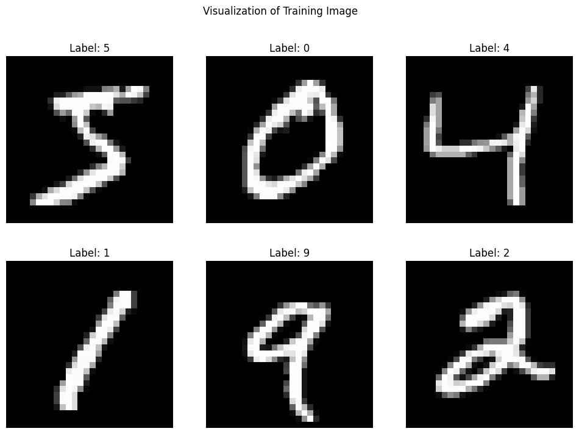
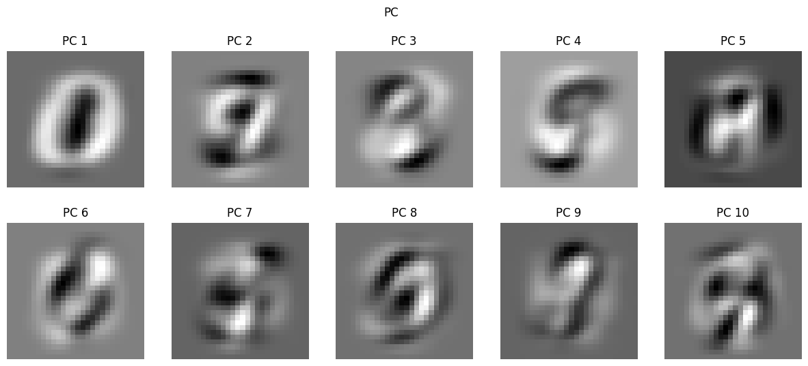
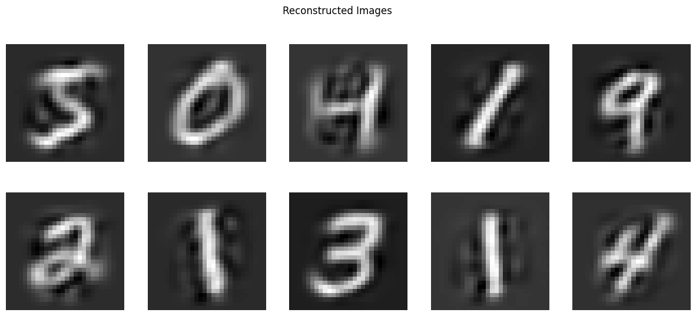
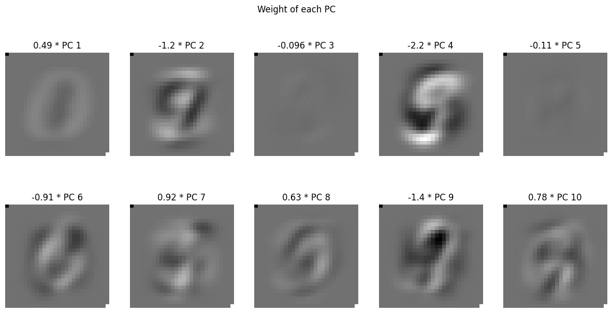
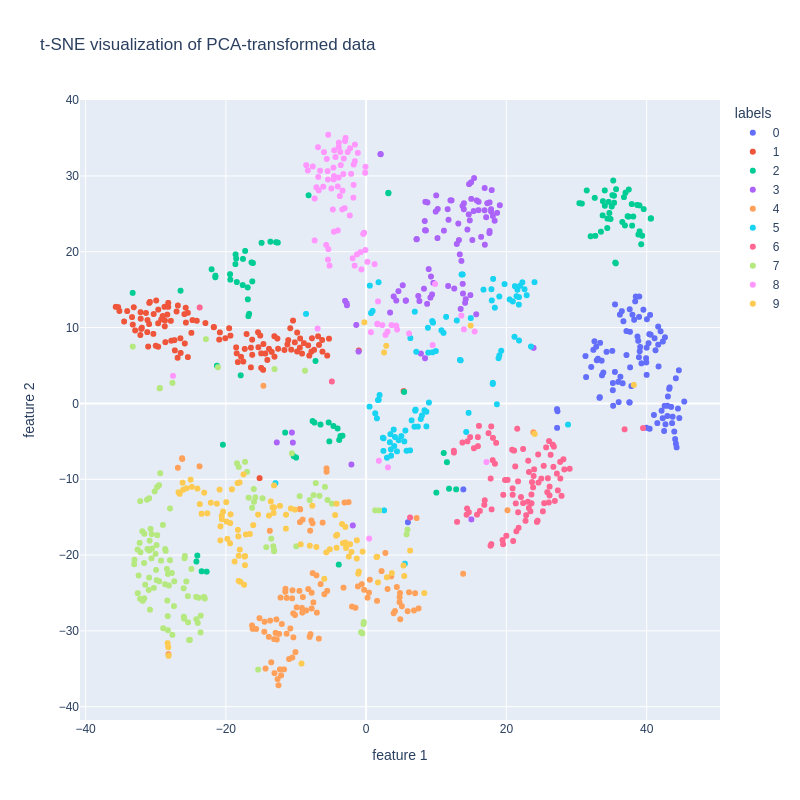
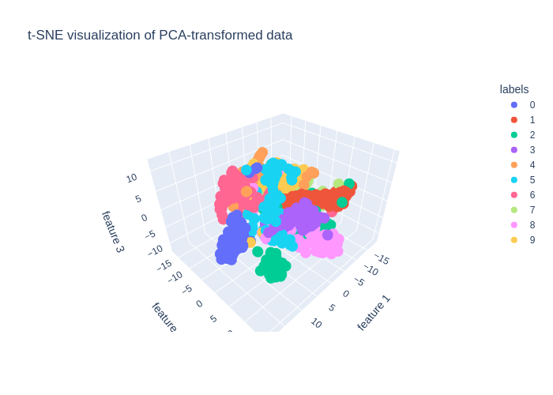
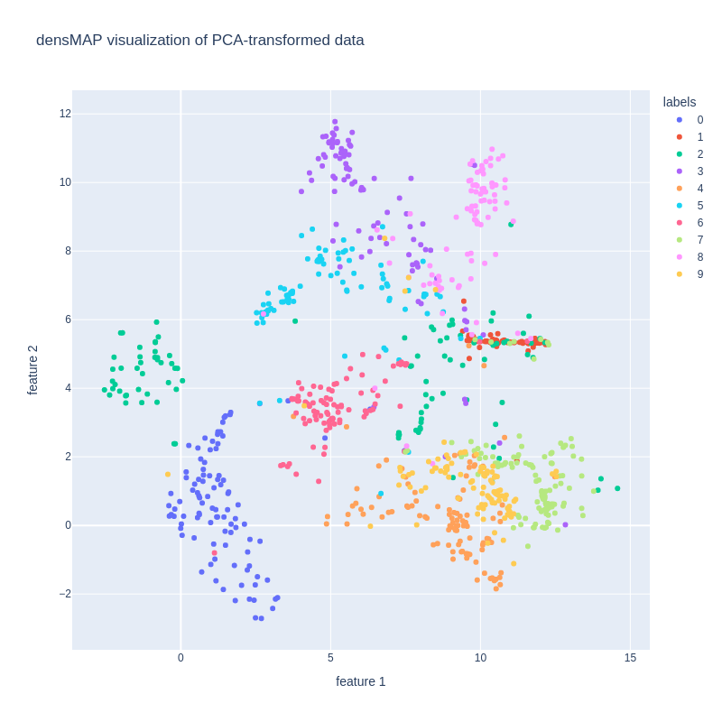
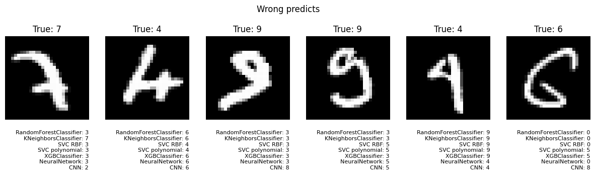
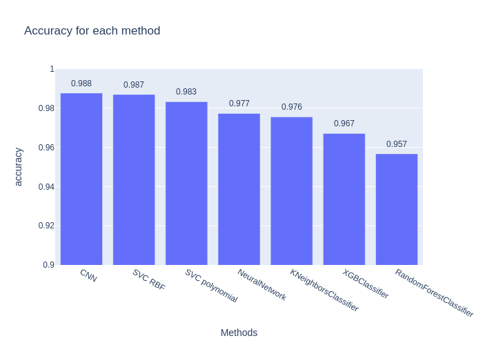
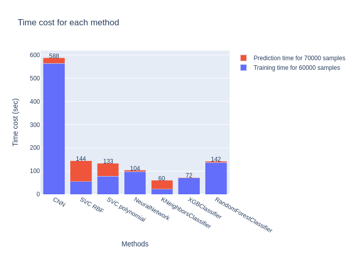

# Comparative Analysis of Image Classification Methods

In this project, I aim to conduct a comparison of various image classification methodologies, including Random Forest, SVM Radial Basis Function (RBF), XGBoost, Neural Network, and Convolutional Neural Networks (CNN). My objective is to evaluate and compare these techniques based on their accuracy, and efficiency in classifying images. This analysis will provide insights into the strengths and weaknesses of each method, guiding future applications in image classification tasks.

## Result

The analysis concludes that the Convolutional Neural Network (CNN) is well suit for image classification tasks, achieving an impressive 98.8% accuracy. Closely following is the SVM Radial Basis Function (RBF), which attained 98.7% accuracy. Other examined models also performed admirably, accuracy rate for these are all above 95%.


```python
display_plotly_as_html_ = False
display_plotly_as_png_ = !display_plotly_as_html_
```


```python
from IPython.core.magic import register_cell_magic

@register_cell_magic
def display_plotly_as_png(line, cell):
    if display_plotly_as_png_:
        get_ipython().run_cell(cell)

@register_cell_magic
def display_plotly_as_html(line, cell):
    if display_plotly_as_html_:
        get_ipython().run_cell(cell)

get_ipython().register_magic_function(display_plotly_as_png, "cell")
get_ipython().register_magic_function(display_plotly_as_html, "cell")
```


```python
%%capture
%%display_plotly_as_png
!pip install -U kaleido fastapi python-multipart uvicorn
```


```python
%%capture
!pip install umap-learn
```


```python
import time
import random
from IPython.display import Image as ImageDisplay

from keras.datasets import mnist, fashion_mnist
import matplotlib.pyplot as plt
import numpy as np
import pandas as pd
import plotly.express as px
import plotly.graph_objects as go
from sklearn.decomposition import PCA
from sklearn.manifold import TSNE
from sklearn.preprocessing import StandardScaler
import umap
```


```python
#Load data set

(train_images, train_labels), (test_images, test_labels) = mnist.load_data()
# (train_images, train_labels), (test_images, test_labels) = fashion_mnist.load_data()

img_h = train_images.shape[1]
img_w = train_images.shape[2]

print(train_images.shape)
print(train_labels.shape)
print(test_images.shape)
print(test_labels.shape)
```

    Downloading data from https://storage.googleapis.com/tensorflow/tf-keras-datasets/mnist.npz
    11490434/11490434 [==============================] - 0s 0us/step
    (60000, 28, 28)
    (60000,)
    (10000, 28, 28)
    (10000,)


```python
train_images_flattened = train_images.reshape((60000, img_h * img_w))
test_images_flattened = test_images.reshape((10000, img_h * img_w))

train_images_normalized = train_images_flattened / 255.0
test_images_normalized = test_images_flattened / 255.0
```

## Image Visualization

Visualizing image data is a critical step in understanding the underlying patterns and characteristics that drive successful classification.


```python
sample_images = train_images_normalized[:6]
sample_labels = train_labels[:6]

plt.figure(figsize=(12, 8))
for i in range(6):
    ax = plt.subplot(2, 3, i + 1)
    ax.imshow(sample_images[i].reshape(img_h, img_w), cmap="gray")
    ax.set_title(f"Label: {sample_labels[i]}")
    ax.axis("off")
plt.suptitle("Visualization of Training Image")
plt.show()
```


    

    


## Principal Component Analysis (PCA)
Principal Component Analysis (PCA) is a powerful statistical technique used in our project to reduce the dimensionality of the image data while retaining most of the important information. This section details the application of PCA and the insights derived from it:


```python
pca = PCA(n_components=0.95)
pca.fit(train_images_normalized)

variance_explained = np.sum(pca.explained_variance_ratio_)
print(f"Number of components, {pca.n_components_}. variance_explained: {variance_explained}")
```

    Number of components, 154. variance_explained: 0.9501960192613034


```python
y = np.zeros(pca.n_components_)
for i in range(len(y)):
  if i == 0:
    y[i] = pca.explained_variance_ratio_[i]
  else:
    y[i] = y[i-1] + pca.explained_variance_ratio_[i]

plt.figure(figsize=(15, 6))
plt.plot([i+1 for i in range(len(y))], y, marker="o", markersize=3, label="Cumulative Explained Variance")
plt.bar(x=[i+1 for i in range(len(y))], height=pca.explained_variance_ratio_, label="Explained Variance")
plt.grid(True)
plt.legend()
plt.ylabel("Explained variance")
plt.xlabel("Number of Principal Component")
plt.title("Variance Explained by Principal Component Cumulative")
plt.xlim(0, len(y)+1)
plt.show()
```


    

    


```python
# pca = PCA(n_components=40)
pca = PCA(n_components=0.8)
pca.fit(train_images_normalized)

variance_explained = np.sum(pca.explained_variance_ratio_)
print(f"Number of components: {pca.n_components_}. variance_explained: {variance_explained}")

pca_transformed_data = pca.transform(train_images_normalized)
pca_transformed_data_test_images = pca.transform(test_images_normalized)
```

    Number of components: 44. variance_explained: 0.8032907553836799


## PCA visualization

Visual representation of Principal Component Analysis (PCA) outcomes played a pivotal role in my understanding of the dataset"s inherent structure. This section elaborates on the visualization techniques employed and the resulting insights:


```python
n = 10
plt.figure(figsize=(15, 6))
for i in range(n):
    ax = plt.subplot(2, int((n+1)/2), i + 1)
    ax.imshow(pca.components_[i].reshape(img_h, img_w), cmap="gray")
    ax.set_title(f"PC {i+1}")
    ax.axis("off")
plt.suptitle("PC")
plt.show()
```


    

    


```python
num = 10
reconstructed_images = pca.inverse_transform(pca_transformed_data[:num])

plt.figure(figsize=(15, 6))
for i in range(10):
    ax = plt.subplot(2, 5, i + 1)
    ax.imshow(reconstructed_images[i].reshape(img_h, img_w), cmap="gray")
    ax.axis("off")
plt.suptitle("Reconstructed Images")
plt.show()
```


    

    


The first picture is the sum of the following PC (only first 10 PC are shown).


```python
pca_0 = np.copy(pca_transformed_data[0])
imgs = np.zeros((10, img_h * img_w))
for i in range(10):
    img = pca_0[i] * pca.components_[i]
    imgs[i, :] = img

plt.figure(figsize=(15, 7))
plt.suptitle(f"Weight of each PC")
for i in range(10):
    ax = plt.subplot(2, 5, i + 1)
    img = imgs[i, :]
    img[0] = imgs.min()
    img[-1] = imgs.max()
    ax.imshow(img.reshape(img_h, img_w), cmap="gray")
    ax.set_title(f"{pca_0[i]:.2} * PC {i+1}")
    ax.axis("off")

plt.show()
```


    

    


## t-SNE Visualization Analysis
In this segment, t-SNE (t-distributed Stochastic Neighbor Embedding) has been utilized to visualize the transformed data. While there is some overlap among certain classes, most of them are distinctly separable. This observation implies that the classes could be linearly separable following appropriate transformations, indicating a potential for high classification accuracy. The t-SNE results offer valuable insights into the inherent structure of the dataset, suggesting that a well-tuned classifier could achieve notable performance.


```python
num_of_examples_for_t_sne = 1000

# Apply t-SNE to the PCA-transformed data
tsne = TSNE(n_components=2, random_state=0)
tsne_results = tsne.fit_transform(pca_transformed_data[:num_of_examples_for_t_sne])
df_array = np.zeros((num_of_examples_for_t_sne, 3))
df_array[:, :2] = tsne_results
df_array[:, 2] = train_labels[:num_of_examples_for_t_sne]

df = pd.DataFrame(df_array, columns=["feature 1", "feature 2", "labels"])
df = df.sort_values(by=["labels"])
# Visualize the results
df["labels"] = df["labels"].astype("int").astype("category")
fig = px.scatter(df, x="feature 1", y="feature 2", color="labels", title="t-SNE visualization of PCA-transformed data", width=800, height=800)
```


```python
%%display_plotly_as_html
fig.show()
```


```python
%%display_plotly_as_png
ImageDisplay(fig.to_image(format="png"))
```


    

    


```python
# Visualizate in 3d

tsne = TSNE(n_components=3, random_state=0)
tsne_results = tsne.fit_transform(pca_transformed_data[:num_of_examples_for_t_sne])
df_array = np.zeros((num_of_examples_for_t_sne, 4))
df_array[:, :3] = tsne_results
df_array[:, 3] = train_labels[:num_of_examples_for_t_sne]

df = pd.DataFrame(df_array, columns=["feature 1", "feature 2", "feature 3", "labels"])
df = df.sort_values(by=["labels"])
df["labels"] = df["labels"].astype("int").astype("category")
fig = px.scatter_3d(df, x="feature 1", y="feature 2", z="feature 3", color="labels", title="t-SNE visualization of PCA-transformed data")

```


```python
%%display_plotly_as_html
fig.show()
```


```python
%%display_plotly_as_png
ImageDisplay(fig.to_image(format="png"))
```


    

    


```python
# Apply densMAP to the PCA-transformed data
reducer = umap.UMAP(densmap=True)
embedding = reducer.fit_transform(pca_transformed_data[:num_of_examples_for_t_sne])

df_array = np.zeros((num_of_examples_for_t_sne, 3))
df_array[:, :2] = embedding[:, :2]
df_array[:, 2] = train_labels[:num_of_examples_for_t_sne]

df = pd.DataFrame(df_array, columns=["feature 1", "feature 2", "labels"])
df = df.sort_values(by=["labels"])
df["labels"] = df["labels"].astype("int").astype("category")
fig = px.scatter(df, x="feature 1", y="feature 2", color="labels", title="densMAP visualization of PCA-transformed data", width=800, height=800)
```


```python
%%display_plotly_as_html
fig.show()
```


```python
%%display_plotly_as_png
ImageDisplay(fig.to_image(format="png"))
```


    

    


## Training the Classifiers
In this phase, I useing a 4-fold cross-validation and select a subset of the training data to ensure manageable training durations. The classifiers selected for this study are diverse, each offering unique strengths in handling different aspects of image classification. The lineup includes:

- Random Forest: A robust ensemble method known for its effectiveness in handling large datasets and high dimensionality.
- K-Nearest Neighbors (KNN): A simple yet powerful algorithm that classifies data based on the closest training examples in the feature space.
- Support Vector Classifier (SVC) with Radial Basis Function (RBF) Kernel: Well-suited for non-linear data classification.
- SVC with Polynomial Kernel: Offering an alternative approach to non-linear classification with a polynomial decision boundary.
- Neural Network: A more complex model that can capture intricate patterns in data through its layered architecture.
- Convolutional Neural Network (CNN): Highly specialized for image data, leveraging convolutional layers to efficiently process pixel data.

Each classifier will be evaluated for its performance and efficiency, providing a comprehensive comparison across different methodologies in image classification.


```python
import time
import random
from IPython.display import Image as ImageDisplay

from keras.datasets import mnist
import matplotlib.pyplot as plt
import numpy as np
import pandas as pd
import plotly.express as px
import plotly.graph_objects as go
from sklearn.decomposition import PCA
from sklearn.model_selection import train_test_split, StratifiedKFold, cross_val_score, GridSearchCV
from sklearn.metrics import accuracy_score, classification_report
from sklearn.base import BaseEstimator, TransformerMixin, ClassifierMixin
from sklearn.pipeline import Pipeline

```


```python
(train_images, train_labels), (test_images, test_labels) = mnist.load_data()

number_of_splits = 4

train_images_small = train_images[:7000]
train_labels_small = train_labels[:7000]
summary = {}
```


```python
class ImageTransformer(BaseEstimator, TransformerMixin):
    def reshape_X(self, X):
        n = X.shape[0]
        l = X.shape[1] * X.shape[2]
        return X.reshape((n, l)) / 255.0

    def fit(self, X, y=None):
        pca = PCA(n_components=0.8)
        pca.fit(self.reshape_X(X))
        self.pca = pca
        return self

    def transform(self, X, y=None):
        return self.pca.transform(self.reshape_X(X))
```


```python
def find_best_param(modelClass, param_grid):
    param_grid_ = {}
    for key in param_grid.keys():
        param_grid_["model__" + key] = param_grid[key]
    pipeline = Pipeline(steps=[('transform', ImageTransformer()), ('model', modelClass())])
    grid_search = GridSearchCV(pipeline, param_grid_, cv=StratifiedKFold(n_splits=number_of_splits), refit=False)
    grid_search.fit(train_images_small, train_labels_small)
    return grid_search.best_params_

def hyperparameter_tuning(modelClass, param_grid, modelName = None):
    best_params = find_best_param(modelClass, param_grid)

    t0 = time.time()

    pipeline = Pipeline(steps=[('transform', ImageTransformer()), ('model', modelClass())])
    pipeline.set_params(**best_params)
    pipeline.fit(train_images, train_labels)

    t1 = time.time()

    y_pred_train = pipeline.predict(train_images)
    accuracy_train = accuracy_score(train_labels, y_pred_train)

    y_pred = pipeline.predict(test_images)
    accuracy = accuracy_score(test_labels, y_pred)

    t2 = time.time()

    if not modelName:
        modelName = modelClass.__name__
    summary[modelName] = {"best_params": best_params, "accuracy": accuracy, "accuracy_train": accuracy_train,
                            "time_train": t1-t0, "time_predict": t2-t1, "time_total": t2-t0,
                            "model": pipeline, "predicts": y_pred}
    return best_params, accuracy
```


```python
from sklearn.ensemble import RandomForestClassifier

param_grid = {
    "n_estimators": [50, 100, 150],
    "max_depth": [None, 100, 150],
}
hyperparameter_tuning(RandomForestClassifier, param_grid)
```


    ({'model__max_depth': None, 'model__n_estimators': 150}, 0.9567)


```python
from sklearn.neighbors import KNeighborsClassifier

param_grid = {
    "n_neighbors": [2, 3, 5, 7],
    "weights": ["uniform", "distance"]
}
hyperparameter_tuning(KNeighborsClassifier, param_grid)
```


    ({'model__n_neighbors': 5, 'model__weights': 'distance'}, 0.9755)


```python
from sklearn.svm import SVC

param_grid = {
    "C": [2, 3, 4],
    "gamma": ["scale", "auto"],
    "kernel": ["rbf"]
}
hyperparameter_tuning(SVC, param_grid, "SVC RBF")
```


    ({'model__C': 4, 'model__gamma': 'auto', 'model__kernel': 'rbf'}, 0.987)


```python
param_grid = {
    "C": [2, 3, 4],
    "degree": [3, 5],
    "kernel": ["poly"]
}
hyperparameter_tuning(SVC, param_grid, "SVC polynomial")
```


    ({'model__C': 3, 'model__degree': 3, 'model__kernel': 'poly'}, 0.9833)


```python
from xgboost import XGBClassifier

param_grid = {
    "max_depth": [5, 6],
    "subsample": [1, 0.75]
}
hyperparameter_tuning(XGBClassifier, param_grid)
```


    ({'model__max_depth': 6, 'model__subsample': 0.75}, 0.9671)


```python
from keras.models import Sequential
from keras.layers import Dense
from keras.utils import to_categorical
from sklearn.model_selection import train_test_split
from keras.regularizers import l2

class NeuralNetworkClassifier(BaseEstimator, ClassifierMixin):
    def __init__(self, layers=None, output_size=10, lam=0.1, batch_size=64):
        if layers is None:
            layers = (64, 32)
        self.layers = layers
        self.output_size = output_size
        self.lam = lam
        self.batch_size = batch_size

    def fit(self, X, y):
        y = to_categorical(y)

        model = Sequential()

        for nodes in self.layers:
            model.add(Dense(nodes, activation="relu", kernel_regularizer=l2(self.lam)))

        model.add(Dense(units=self.output_size, activation="softmax"))
        model.compile(optimizer="adam", loss="categorical_crossentropy", metrics=["accuracy"])
        model.fit(X, y, epochs=20, batch_size=self.batch_size, verbose=0)
        self.model = model
        return self

    def predict(self, X):
        pred = self.model.predict(X, verbose=0)
        return np.argmax(pred, axis=1)


param_grid = {
    "layers": [(64, 32), (64, 32, 32)],
    "lam": [0.0005, 0.001, 0.005],
    "batch_size": [64, 128],
    "output_size": [10]
}
hyperparameter_tuning(NeuralNetworkClassifier, param_grid, "NeuralNetwork")
```


    ({'model__batch_size': 64,
      'model__lam': 0.001,
      'model__layers': (64, 32),
      'model__output_size': 10},
     0.9773)


```python
from keras.layers import Conv2D, MaxPooling2D, Flatten

# Load and preprocess the data
(X_train, y_train), (X_test, y_test) = mnist.load_data()
X_train = X_train.reshape((60000, 28, 28, 1)).astype("float32") / 255
X_test = X_test.reshape((10000, 28, 28, 1)).astype("float32") / 255
y_train = to_categorical(y_train)
y_test = to_categorical(y_test)

t0 = time.time()
model = Sequential()
model.add(Conv2D(32, (3, 3), activation="relu"))
model.add(MaxPooling2D((2, 2)))
model.add(Conv2D(64, (3, 3), activation="relu"))
model.add(MaxPooling2D((2, 2)))
model.add(Flatten())
model.add(Dense(64, activation="relu"))
model.add(Dense(10, activation="softmax"))

model.compile(optimizer="adam", loss="categorical_crossentropy", metrics=["accuracy"])
model.fit(X_train, y_train, epochs=10, batch_size=64, verbose=0)
t1 = time.time()
_, accuracy_train = model.evaluate(X_train, y_train, verbose=0)
_, accuracy = model.evaluate(X_test, y_test, verbose=0)
t2 = time.time()

summary["CNN"] = {"best_params": {}, "accuracy": accuracy, "accuracy_train": accuracy_train, "time_train": t1-t0, "time_predict": t2-t1, "time_total": t2-t0,
                  "model": model, "predicts": np.argmax(model.predict(X_test, verbose=0), axis=1)}
accuracy
```


    0.9876999855041504


### Visualization of Incorrect Predictions


```python
wrong_count = {}
for key in summary.keys():
  wrong_indices = np.where(summary[key]["predicts"] != test_labels)[0]
  for index in wrong_indices:
    wrong_count[index] = wrong_count.get(index, 0) + 1

wrong_count_list = [(key, wrong_count[key]) for key in wrong_count if wrong_count[key] > 3]
random.shuffle(wrong_count_list)

def plot_image(index, ax):
    ax.imshow(test_images[index].reshape(28, 28), cmap="gray")
    t = ""
    for key in summary.keys():
      t += f"{key}: {summary[key]['predicts'][index]}\n"
    ax.set_title(f"True: {test_labels[index]}")
    ax.annotate(t, xy = (1, -0.4), xycoords="axes fraction", ha="right", va="center", fontsize=8)
    ax.axis("off")

fig, axes = plt.subplots(1, 6, figsize=(15, 3))
for i in range(6):
    if i < len(wrong_count_list):
        plot_image(wrong_count_list[i][0], axes[i])
    else:
        axes[i].axis("off")
plt.suptitle("Wrong predicts")
plt.show()

```


    

    


```python
data = [(method, summary[method]["accuracy"], summary[method]["accuracy_train"], summary[method]["time_train"], summary[method]["time_predict"], summary[method]["time_total"]) for method in summary.keys()]
df = pd.DataFrame(data, columns=["method", "accuracy", "accuracy_train", "time_train", "time_predict", "time_total"])
df = df.sort_values(by=["accuracy"], ascending=False)
print(df)
```

                       method  accuracy  accuracy_train  time_train  time_predict  \
    6                     CNN    0.9877        0.997683  563.943963     23.446228   
    2                 SVC RBF    0.9870        0.997733   54.702107     88.910634   
    3          SVC polynomial    0.9833        0.997817   77.075998     55.578312   
    5           NeuralNetwork    0.9773        0.984367   96.884197      6.411389   
    1    KNeighborsClassifier    0.9755        1.000000   21.029321     38.236061   
    4           XGBClassifier    0.9671        0.999983   69.311949      2.353380   
    0  RandomForestClassifier    0.9567        1.000000  136.787052      4.838271   
    
       time_total  
    6  587.390191  
    2  143.612742  
    3  132.654310  
    5  103.295586  
    1   59.265382  
    4   71.665328  
    0  141.625323  


```python
for col in ["time_train", "time_predict", "time_total"]:  # for visualization
  df[col] = np.ceil(df[col]).astype(int)
```


```python
fig = go.Figure()

fig.add_trace(go.Bar(x=df["method"], y=df["accuracy"], name="accuracy"))

for i, row in df.iterrows():
    fig.add_annotation(
        x=row["method"],
        y=row["accuracy"] + 0.005,
        text=f"{row['accuracy']:.3f}",
        showarrow=False
    )

fig.update_layout(title="Accuracy for each method", xaxis_title="Methods", yaxis_title="accuracy", yaxis=dict(range=[0.9, 1]));
```


```python
%%display_plotly_as_html
fig.show()
```


```python
%%display_plotly_as_png
ImageDisplay(fig.to_image(format="png"))
```


    

    


```python
fig = go.Figure()

fig.add_trace(go.Bar(x=df["method"], y=df["time_train"], name=f"Training time for {len(train_labels)} samples"))
fig.add_trace(go.Bar(x=df["method"], y=df["time_predict"], name=f"Prediction time for {len(train_labels) + len(test_labels)} samples"))

for i, row in df.iterrows():
    fig.add_annotation(
        x=row["method"],
        y=row["time_total"] + 8,
        text=str(row["time_total"]),
        showarrow=False
    )

fig.update_layout(barmode="stack", title="Time cost for each method", xaxis_title="Methods", yaxis_title="Time cost (sec)");
```


```python
%%display_plotly_as_html
fig.show()
```


```python
%%display_plotly_as_png
ImageDisplay(fig.to_image(format="png"))
```


    

    


```python
!rm -rf /README_files
!rm -rf /README_files.md
!rm /README_files.zip
# !jupyter nbconvert --to markdown "/classification.ipynb" --output README.md
# !zip -r /README_files.zip /README_files
```

    rm: cannot remove '/README_files.zip': No such file or directory


```python

```
